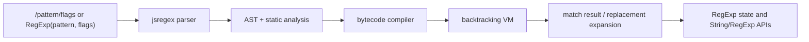

# Native RegExp Engine

Status: Proposed
Owning subsystem: Script
Target package: `internal/script/jsregex`

## Summary

browser-tester-go will replace the current RE2/regexp2 hybrid used for classic-JS regex literals
and regex-aware string methods with a Go-owned ECMAScript regular-expression engine. The public
surface does not change; only the implementation path does.

## Context

- `internal/script/regexp_support.go` currently chooses between `regexp` and `github.com/dlclark/regexp2`.
- That split keeps browser semantics dependent on a third-party package and forces heuristics such as
  `classicJSRegexpNeedsRegexp2`.
- The regex surface needs browser-style behavior for lookahead, lookbehind, backreferences,
  named captures, replacement templates, `lastIndex`, zero-width match handling, and UTF-16-aware
  indexing.
- The engine must stay deterministic and explicit about unsupported syntax or runtime limits.

## Decision

Implement a dedicated `internal/script/jsregex` subsystem that owns parsing, compilation, execution,
and replacement expansion. All regex literals and all regex-aware `String.*` / future `RegExp.*`
behavior will route through that subsystem. No production code path will silently fall back to RE2 or
regexp2.

## Package Layout

The exact files can change, but the intended ownership is:

```text
internal/script/jsregex/
  ast.go
  compile.go
  parser.go
  replace.go
  state.go
  utf16.go
  vm.go
```

- `parser.go` tokenizes the pattern and flags, then builds a structured AST.
- `ast.go` stores the node shapes and static-analysis metadata.
- `compile.go` lowers the AST to a compact internal program.
- `vm.go` executes that program with an explicit backtracking stack.
- `replace.go` parses and applies `$`-style replacement templates.
- `utf16.go` maps Go strings to JS code-unit offsets and back.
- `state.go` holds immutable compiled patterns plus mutable regex-instance state.

## Data Model

The engine should keep regex state out of plain object metadata and attach it to the script `Value`
as a dedicated internal slot, analogous to `MapState` and `SetState`.

- `CompiledPattern` is immutable and contains the source text, flags, AST, opcode stream, capture
  metadata, named-group metadata, and static analyses such as minimum width and first-set hints.
- `RegexpState` is mutable and stores the compiled pattern pointer, `lastIndex`, and flag-derived
  mode bits such as `global`, `sticky`, `unicode`, `hasIndices`, and `unicodeSets`.
- `MatchResult` carries the full match, numbered captures, named captures, match offsets, and any
  `d`-flag index data needed by the JS bridge.
- `ReplacementTemplate` is tokenized once so `replace()` and `replaceAll()` do not reparse the same
  substitution text on every match.

## Execution Model



- Matching runs over UTF-16 code units, not Go rune indexes.
- The bridge converts JS-visible offsets to Go byte slices only when it needs to build strings or
  capture substrings.
- The VM must use an explicit stack and step budget. Recursive Go calls are too brittle for regex
  backtracking and make deterministic failure handling harder.
- `AdvanceStringIndex` semantics must guard zero-width global and sticky loops.

## Semantics

- Literal parsing and `RegExp(pattern, flags)` share the same compiler.
- Lookahead, lookbehind, and backreferences are handled in the VM, not delegated to another engine.
- Lookbehind validation is explicit. Fixed-width lookbehind is allowed; variable-width lookbehind
  must fail with a clear parse or unsupported error.
- Case-insensitive matching uses ECMAScript canonicalization, not locale-sensitive comparison.
- `u` and `v` are parser modes as well as execution modes; they affect escapes, classes, and code
  point handling before the VM runs.
- `g` and `y` mutate `lastIndex` according to ECMAScript rules.
- `d` collects capture indices for `exec()` and the match result object.
- Replacement expansion must support the usual browser `$` tokens for the whole match, prefix,
  suffix, numbered captures, and named captures.

## Bridge Responsibilities

The bridge layer in `internal/script/classic_script.go`, `internal/script/stdlib_methods.go`, and
`internal/script/browser_value_helpers.go` should stay thin:

- parse the literal delimiters and flags
- build or reuse the compiled regex state
- call the engine for `test`, `exec`, `search`, `match`, `replace`, `replaceAll`, `split`, and
  future `RegExp` prototype methods
- translate engine errors into the existing script error taxonomy
- preserve object identity and mutable `lastIndex` state when the regex value is cloned or carried
  through runtime snapshots

## Error Model

- Syntax mistakes become parse errors at the caller boundary.
- Unsupported syntax or unsupported flags become explicit unsupported errors.
- Step-budget exhaustion and other execution failures become runtime errors.
- The bridge must not silently convert an unsupported construct into a plain string match or any
  other fallback path.

## Migration Plan

1. Add `internal/script/jsregex` and route regex literals through it first.
2. Move string-regex helpers onto the same engine so there is one matching path.
3. Add `RegExp` constructor and prototype behavior on top of the same compiled state.
4. Remove the stdlib `regexp` and third-party `regexp2` dependencies from the production path.
5. Delete heuristic fallback detection once the native engine covers the bounded slice.
6. Update the placement docs and roadmap in the same change so the engine stays discoverable.

## Testing Plan

- Parser and compiler unit tests in `internal/script`.
- VM tests for lookahead, lookbehind, backreferences, named captures, zero-width matches, and
  replacement templates.
- Public contract tests for regex literals and the string methods that consume them.
- Bootstrap regression tests for the browser-facing cases that currently exercise regex literals.
- Failure-path tests for malformed patterns, duplicate or unsupported flags, unsupported syntax,
  and step-budget exhaustion.
- Fuzz/property coverage for parser boundaries and zero-width scan loops.

## Documentation Notes

- Keep `doc/subsystem-map.md`, `doc/implementation-guide.md`, `doc/roadmap.md`, and `TODO.md` in
  sync with this design.
- The public capability matrix does not change; this is an internal architecture change that keeps
  the same browser-visible promise while removing the external engine dependency.
